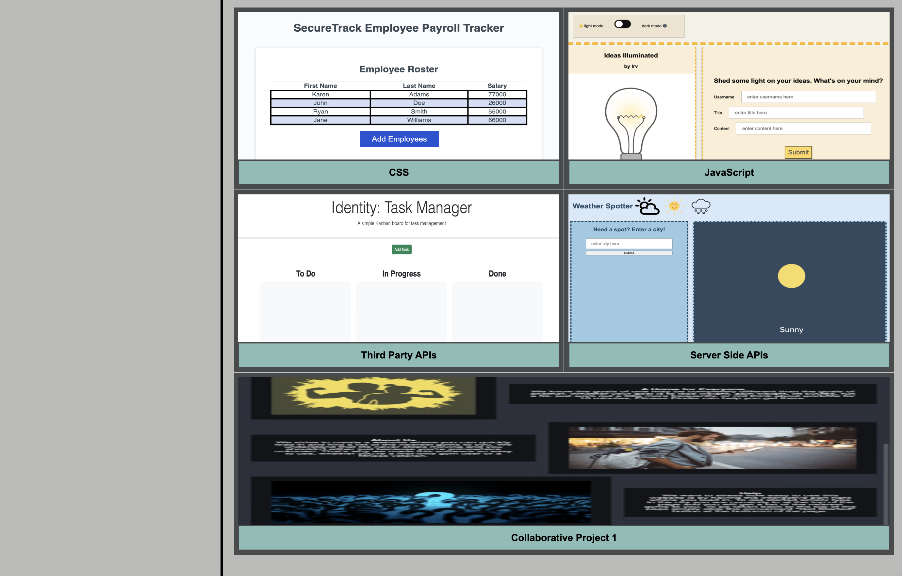

<h1> innovate with irv </h1>
<h3> Innovate with Irv showcases the skillsets I am developing using the Coding Bootcamp from UCI. Thus far, I have learned about the foundation of content, HTML, the styling of content, CSS, and the dynamic properties that create function and dimension, JavaScript. Therefore, this page is a dynamic reflection and juxtaposition of what I have learned, currently learn, and will learn. The beauty of coding is that learning is a constant, and therefore, so is the content that presents here.  

<h4> Visit us at <a href="https://scurvyirv.github.io/innovate-with-irv/"> Innovate with Irv</a> to see my journey through the world of coding! </h4>

